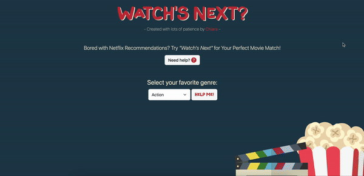

# "Watch's Next?" Web application

Watch's Next is an interactive web app which lets the users choose a genre of movie and the proposes them a random movie they may like. 
The app is build on the Themoviedatabase API. How the app works:

1. A fetch GET request is made to the API in order to retrieve the list of genres available. The genres are then presented as options in a dropdown menu.
2. The user selects the desired genre and hit the submit button. The selected genre is passed as value to the results.html page. A fetch GET request is made to the API in order to retrieve all the movies which fall under the selected genre; then the app selects a random movie to offer the user.
3. Once the app shows the user a random movie a function is called to display a 'like' and 'dislike' button:
  - The 'like' button, once clicked, disables the 'dislike' button and suggest the user to visit the tmdb page of the current displayed movie; this is done by passing the movie ID to the tmdb link.
  - The 'dislike' button, once clicked, disables the 'like' button and suggest the user another movie from the same genre. If the user clicks on the link it is then brought to the tmdb page of the alternative movie; this is done by passing the movie ID to the tmdb link.

## Color Reference

| Color             | Hex                                                                |
| ----------------- | ------------------------------------------------------------------ |
| #EDE8D0 |  #ede8d0 |
| #C12E3D |  #c12e3d |
| #223E50 |  #223e50 |

## Demo

## Features

- Responsive
- Mobile First
- Cross platform
- Content generated by fetch GET requests from the tmdb API

## Tech Stack

HTML, CSS, Bootstrap, Javascript

