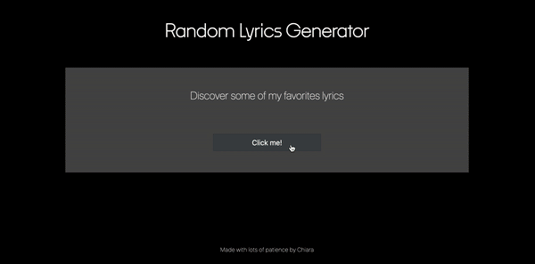

# Random Lyrics Generator

Random Lyrics Generator is a web app that randomly selects and shows lyrics from my favorites songs.

**How it works**

Once the user clicks on the button "Click me!" or press the "Enter" key a function is called. The function, among other functionalities, loops an array and randomly selects the index of one of the array's items; then the function retrieves the item's properties given the random index.

## Demo

## Features

- Responsive
- Cross platform

## Tech Stack

HTML, CSS, JavaScript, Bootstrap

